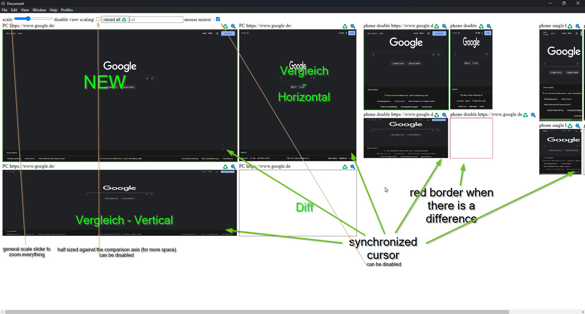

# dev platform

## setup

- in config/profile.json
  - similar to [src/handlers/default-profile.ts](src/handlers/default-profile.ts) but as json
  - then just launch the thing :)

## Idea

- the app intercepts events of the active browser window and attempts to simulate the appropriate event in the other windows

- forms:
  - in order to simplify testing and development i added a form cache that will refill all forms based on the action url

## example below

a click on for example "login" weill open the login dialog symultaniously in all subframes

